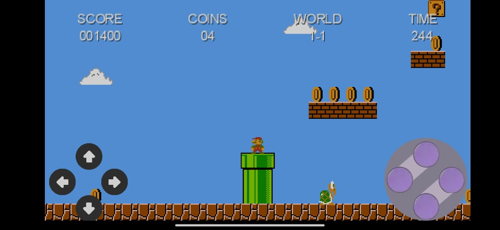
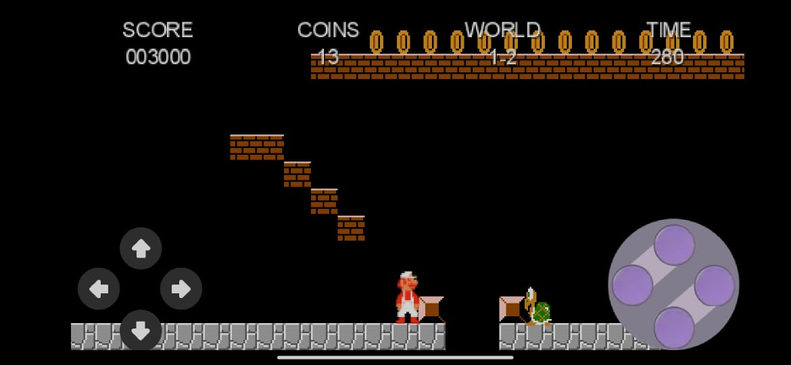

# Super Mario Bros
Remake do game *Super Mario Bros* feito em Java com o framework *LibGDX*

*Screenshots:*

## Geração executável desktop
1. Rode o comando abaixo para gerar o executável desktop:
`./gradlew desktop:dist`
2. Será gerado um JAR do tipo release no diretório abaixo:
`MarioBros/desktop/build/libs`

## Geração WEB
1. Rode o comando para gerar a versão WEB
`./gradlew html:dist`

2. Em seguida rodar o comando abaixo para subir a versão web gerada para nuvem:
`./deployHTML.sh`

3. quando terminar a execução, o jogo ficará disponível em:
`http://vps6174.publiccloud.com.br/mario`

## Geração APK Android

1. Rode o comando abaixo para gerar a APK release:
`./gradlew android:assembleRelease`
   

2. Entre no diretório abaixo, nele deverá ser gerado um APK não assinado:
`MarioBros/android/build/outputs/apk/release`
   

3. Caso ainda não tenha criado uma keystore, crie uma com o comando abaixo:
`keytool -genkeypair -v -keystore mario.keystore -alias publishingdoc -keyalg RSA -keysize 2048 -validity 10000`
   

4. Depois rode o zipalign para otimizar o apk gerado
`zipalign -f -v 4 android-release-unsigned.apk mario-release-signed.apk`
   

5. Por último, rode o apksigner para gerar o apk assinado
`apksigner sign --ks mario.keystore --ks-key-alias publishingdoc mario-release-signed.apk` 
   
   
6. O APK gerado e assinado estará disponível no diretório abaixo:
`MarioBros/android/build/outputs/apk/release`
   
*Dica: os utilitários zipalign e apksigner podem ser encontrados na pasta de instalação do SDK do Android:*
`Android/Sdk/build-tools/30.0.2/`

*Obs.: O game foi desenvolvido com base no canal do Brent Aureli's
https://www.youtube.com/playlist?list=PLZm85UZQLd2SXQzsF-a0-pPF6IWDDdrXt*

